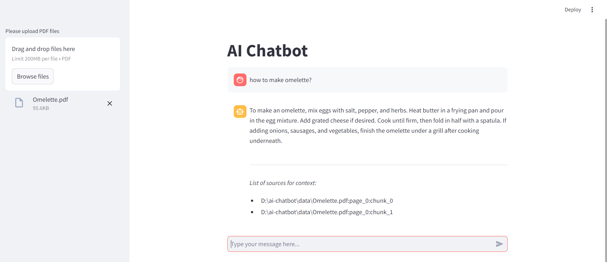

# AI Chatbot

RAG Chatbot built with LangChain and Streamlit. It allows you to chat with your PDFs and get insights from your own private knowledge bases.


## Quickstart
1. Clone the repository
2. Navigate into the project folder
3. Create virtual environment

```
python -m venv .venv
```

4. Activate the virtual environment

```
./.venv/Scripts/activate
```

5. Install the dependencies

```
pip install -r requirement.txt
```

6. Create .env file and add your OpenAI API key

```
OPENAI_API_KEY=your-api-key-here
```

7. Run the Streamlit app

```
streamlit run src/app.py
```

## Walkthrough
1. Navigate to the Streamlit app in web browser (e.g: http://localhost:8501)
2. Drag and drop your PDF file(s) to the sidebar
3. Start asking questions about the content of the uploaded file

